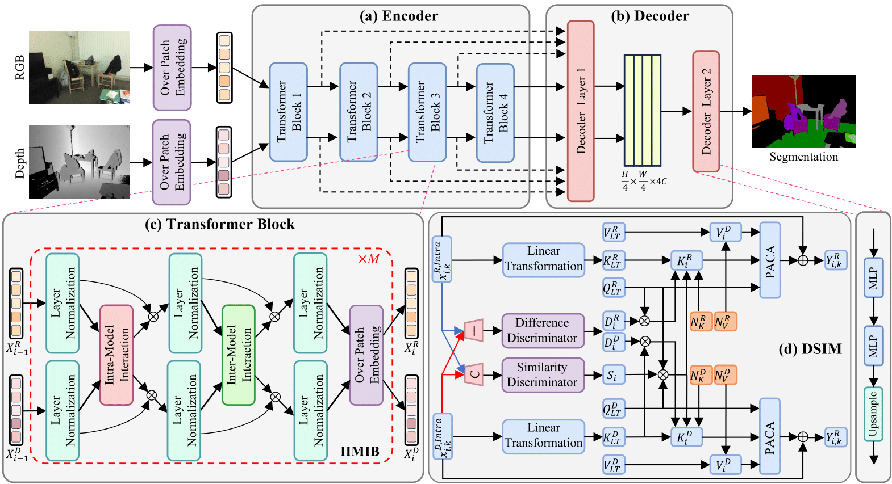
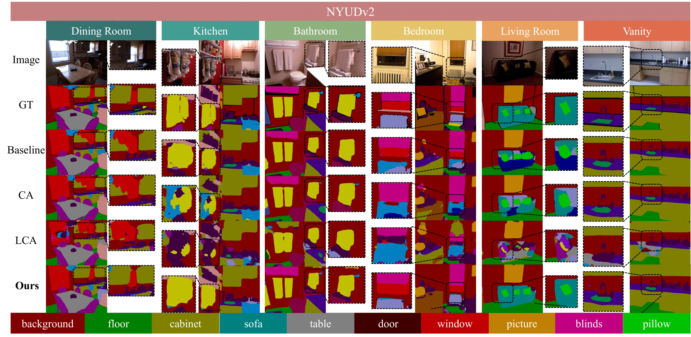
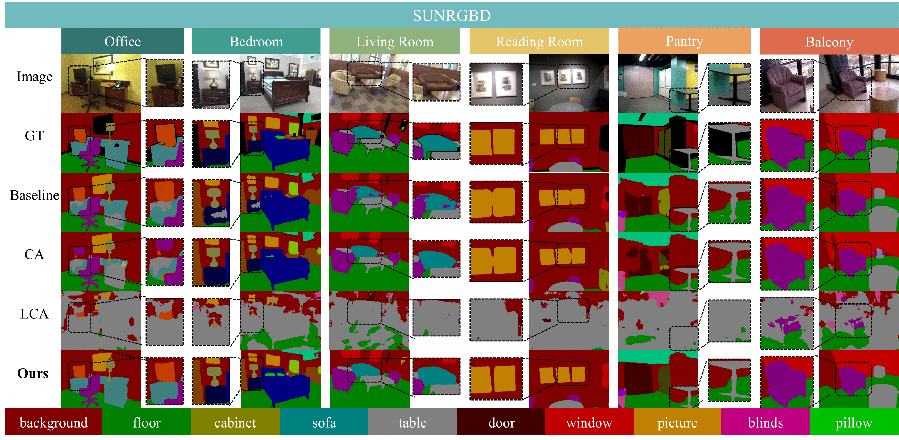

# DiffPixelFormer: Differential Pixel-aware Transformer for RGB-D Indoor Scene Segmentation

Pytorch implementation of "DiffPixelFormer: Differential Pixel-aware Transformer for RGB-D Indoor Scene Segmentation"

<div align="center">
   
</div>
Fig. 1 The overall architecture of DiffPixelFormer comprises an encoder–decoder structure, where the encoder incorporates multiple Intra–Inter Modal Interaction Blocks (IIMIBs) to facilitate both intra-modal and inter-modal feature interactions.

# Changelog
[2025-10-24] Release the README for DiffPixelFormer.  
[2025-10-20] Release the final code for DiffPixelFormer.  
[2025-06-26] Release the initial code for DiffPixelFormer.

# Dataset
[NYUDv2 Dataset](https://github.com/yikaiw/TokenFusion)

Please follow the data preparation instructions for NYUDv2 in TokenFusion readme. In default the data path is /cache/datasets/nyudv2, you may change it by --train-dir <your data path>.

[SUN RGBD Dataset](https://rgbd.cs.princeton.edu/)

Please download the SUN RGBD dataset follow the link in DFormer. In default the data path is /cache/datasets/sunrgbd_Dformer/SUNRGBD, you may change it by --train-dir <your data path>.

# Train

## SUNRGB-D
```
CUDA_VISIBLE_DEVICES=0,1,2,3,4,5,6,7 python -m torch.distributed.launch --nproc_per_node=8  --use_env main.py --backbone mit_b3 --dataset sunrgbd --train-dir SUNRGBD -c sunrgbd_mit_b3 
```

## NYUDv2
```
CUDA_VISIBLE_DEVICES=0,1,2,3,4,5,6,7 python -m torch.distributed.launch --nproc_per_node=8 --use_env main.py --backbone mit_b1 --batch-size 10 --dataset nyudv2  --train-dir NYUDepthv2 -c nyudv2_mit_b1
```

# Test
## SUNRGB-D
```
CUDA_VISIBLE_DEVICES=0,1,2,3,4,5,6,7 python -m torch.distributed.launch --nproc_per_node=8  --use_env main.py --backbone mit_b3 --dataset sunrgbd -c sunrgbd_mit_b3 --eval --resume mit-b3.pth.tar
```

## NYUDv2
```
CUDA_VISIBLE_DEVICES=0,1,2,3 python -m torch.distributed.launch --nproc_per_node=4  --use_env main.py --backbone mit_b3 --dataset nyudv2 --train-dir NYUDepthv2 -c nyudv2_mit_b3_pixel_att_parallel_diff_softmax_with_sclar_sum1_test --num-workers 0 --eval --resume 
```

# Performance
Table I Comparison of existing state-of-the-art methods on the SUN RGB-D and NYUDv2 datasets. Bold values indicate the best performance, while underlined values denote the second-best performance for each metric. The symbol “–” indicates results that were not reported in the original papers.

| Model                        | Backbone            | Publication | Year | Param(M) | SUN RGB-D mIoU | SUN RGB-D Pixel Acc | SUN RGB-D mAcc | NYUDv2 mIoU | NYUDv2 Pixel Acc | NYUDv2 mAcc |
|------------------------------|---------------------|-------------|------|----------|----------------|--------------------|----------------|-------------|------------------|-------------|
| RDFNet                       | ResNet-101          | ICCV        | 2017 | -        | 47.70          | 81.50              | 60.10          | 50.10       | 76.00            | 62.80       |
| RefineNet                    | ResNet-152          | CVPR        | 2017 | -        | 45.90          | 80.60              | 58.50          | 46.50       | 73.60            | 58.90       |
| SSMA                         | ResNet-50           | IJCV        | 2020 | -        | 45.70          | 81.00              | 58.10          | 48.70       | 75.20            | 60.50       |
| AsymFusion                   | ResNet-50           | ACM MM      | 2020 | -        | -              | -                  | -              | 51.20       | 77.00            | 64.00       |
| SGNet                        | ResNet-101          | IEEE TIP    | 2021 | 64.70    | 48.60          | -                  | -              | 51.10       | -                | -           |
| ESANet                       | ResNet-34           | ICRA        | 2021 | 31.20    | 48.20          | -                  | -              | 50.30       | -                | -           |
| ShapeConv                    | ResNeXt-101         | ICCV        | 2021 | 86.80    | 48.60          | -                  | -              | 51.30       | -                | -           |
| CEN                          | ResNet-50           | IEEE TIP    | 2022 | -        | 51.10          | _83.50_            | 63.20          | 52.50       | 77.70            | 65.00       |
| MultiMAE                     | ViT-Base            | ECCV        | 2022 | 95.20    | 51.10          | -                  | -              | 56.00       | -                | -           |
| Omnivore                     | Swin-Small          | CVPR        | 2022 | 95.70    | -              | -                  | -              | 54.00       | -                | -           |
| PGDENet                      | ResNet-34           | IEEE TMM    | 2022 | 100.70   | 51.00          | -                  | -              | 53.70       | -                | -           |
| EMSANet                      | ResNet-34           | IJCNN       | 2022 | 46.90    | 50.90          | -                  | -              | 59.00       | -                | -           |
| TokenFusion-B2               | MiT-B2              | CVPR        | 2022 | 26.00    | 50.30          | -                  | -              | 53.30       | -                | -           |
| TokenFusion-B3               | MiT-B3              | CVPR        | 2022 | 45.90    | 51.40          | 82.80              | 63.60          | 54.20       | 79.00            | 66.90       |
| TokenFusion-B5               | MiT-B5              | CVPR        | 2022 | 83.30    | 51.80          | 83.10              | 63.90          | 55.10       | 79.10            | 67.50       |
| CMX-B2                       | MiT-B2              | IEEE T-ITS  | 2023 | 66.60    | 49.70          | -                  | -              | 54.40       | -                | -           |
| CMX-B4                       | MiT-B4              | IEEE T-ITS  | 2023 | 139.90   | 52.10          | -                  | -              | 56.30       | -                | -           |
| CMX-B5                       | MiT-B5              | IEEE T-ITS  | 2023 | 181.10   | 52.40          | -                  | -              | 56.90       | -                | -           |
| CMNext                       | MiT-B4              | CVPR        | 2023 | 119.60   | 51.90          | -                  | -              | 56.90       | -                | -           |
| DPLNet                       | MiT-B5              | IROS        | 2024 | -        | 52.80          | -                  | -              | 58.30       | -                | -           |
| GeminiFusion                 | MiT-B3              | arXiv       | 2024 | 75.80    | 52.70          | 83.30              | 64.60          | 56.80       | 79.90            | 69.90       |
| DFormer-T                    | DFormer-Tiny        | ICRL        | 2024 | 6.00     | 48.80          | -                  | -              | 51.80       | -                | -           |
| DFormer-S                    | DFormer-Small       | ICRL        | 2024 | 18.70    | 50.00          | -                  | -              | 53.60       | -                | -           |
| DFormer-B                    | DFormer-Base        | ICRL        | 2024 | 29.50    | 51.20          | -                  | -              | 55.60       | -                | -           |
| DFormer-L                    | DFormer-Large       | ICRL        | 2024 | 39.00    | 52.50          | -                  | -              | 57.20       | -                | -           |
| AsymFormer                   | MiT-B0+ConvNeXt-Tin | CVPR        | 2024 | 33.00    | 49.10          | -                  | -              | 55.30       | -                | -           |
| PolyMaX                      | ConvNeXt-L          | WACV        | 2024 | -        | -              | -                  | -              | 58.10       | -                | -           |
| DFormerV2-S                  | DFormerV2-Small     | CVPR        | 2025 | 26.70    | 51.50          | -                  | -              | 56.00       | -                | -           |
| DFormerV2-B                  | DFormerV2-Base      | CVPR        | 2025 | 53.90    | 52.80          | -                  | -              | 57.70       | -                | -           |
| DFormerV2-L                  | DFormerV2-Large     | CVPR        | 2025 | 95.50    | 53.30          | -                  | -              | 58.40       | -                | -           |
| EACNet                       | ConvNeXt-T+VAN-B0   | DDCLS       | 2025 | 37.00    | 52.60          | -                  | -              | 57.60       | -                | -           |
| **DiffPixelFormer-S (ours)** | MiT-B3              | CVPR        | 2025 | 85.41    | 52.84          | 83.37              | 64.83          | 56.28       | 79.79            | 68.98       |
| **DiffPixelFormer-M (ours)** | MiT-B5              | CVPR        | 2025 | 157.24   | _53.69_        | 83.47              | **66.11**      | _58.71_     | _80.30_          | _69.93_     |
| **DiffPixelFormer-L (ours)** | Swin-Large          | CVPR        | 2025 | 369.22   | **54.28**      | **84.14**          | _65.91_        | **59.95**   | **81.70**        | **72.74**   |

# Visualization Result

Fig. 2 Quantitative comparison of our DiffPixelFormer with the baseline and various cross-attention methods on NYUDv2, where GT denotes the ground truth.
<div align="center">
   
</div>

Fig. 3 Quantitative comparison of our DiffPixelFormer with the baseline and various cross-attention methods on SUNRGB-D.
<div align="center">
   
</div>

## Acknowledgement
Part of our code is based on the open-source project [TokenFusion](https://github.com/yikaiw/TokenFusion) and [GeminiFusion](https://github.com/JiaDingCN/GeminiFusion).